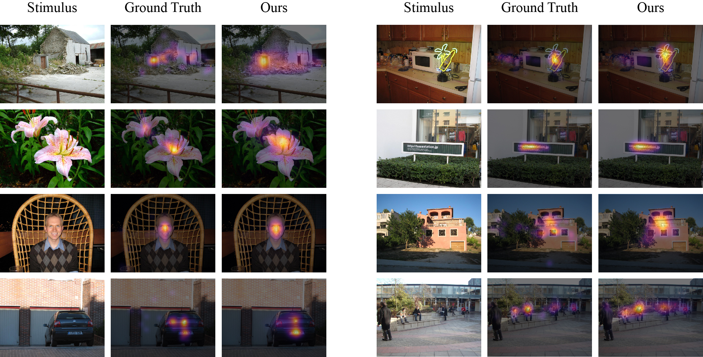
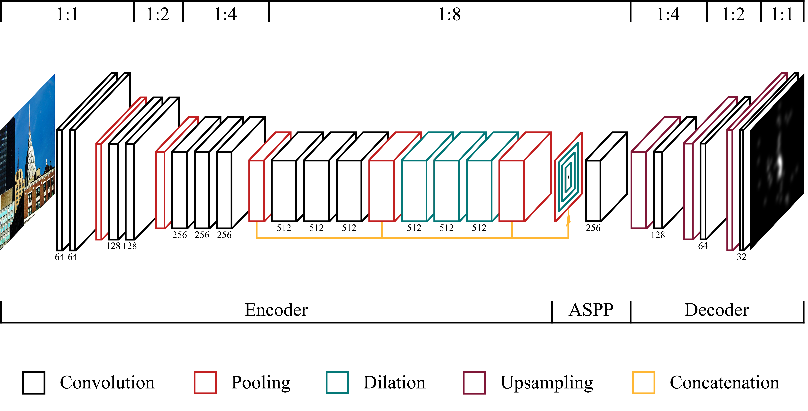

# Contextual Encoder-Decoder Network <br/> for Visual Saliency Prediction



This repository contains the official **TensorFlow** implementation of the **MSI-Net** (multi-scale information network), as described in the Neural Networks paper [Contextual encoder-decoder network for visual saliency prediction](https://www.sciencedirect.com/science/article/pii/S0893608020301660) (2020) and on [arXiv](https://arxiv.org/abs/1902.06634).

**_Abstract:_** *Predicting salient regions in natural images requires the detection of objects that are present in a scene. To develop robust representations for this challenging task, high-level visual features at multiple spatial scales must be extracted and augmented with contextual information. However, existing models aimed at explaining human fixation maps do not incorporate such a mechanism explicitly. Here we propose an approach based on a convolutional neural network pre-trained on a large-scale image classification task. The architecture forms an encoder-decoder structure and includes a module with multiple convolutional layers at different dilation rates to capture multi-scale features in parallel. Moreover, we combine the resulting representations with global scene information for accurately predicting visual saliency. Our model achieves competitive and consistent results across multiple evaluation metrics on two public saliency benchmarks and we demonstrate the effectiveness of the suggested approach on five datasets and selected examples. Compared to state of the art approaches, the network is based on a lightweight image classification backbone and hence presents a suitable choice for applications with limited computational resources, such as (virtual) robotic systems, to estimate human fixations across complex natural scenes.*

Our results are available on the original [MIT saliency benchmark](http://saliency.mit.edu/results.html) and the updated [MIT/Tübingen saliency benchmark](https://saliency.tuebingen.ai/results.html). The latter are derived from a probabilistic version of our model with metric-specific postprocessing for a fair model comparison.

## Reference

If you use this code in your research, please cite the following paper:

```
@article{kroner2020contextual,
  title={Contextual encoder-decoder network for visual saliency prediction},
  author={Kroner, Alexander and Senden, Mario and Driessens, Kurt and Goebel, Rainer},
  url={http://www.sciencedirect.com/science/article/pii/S0893608020301660},
  doi={https://doi.org/10.1016/j.neunet.2020.05.004},
  journal={Neural Networks},
  publisher={Elsevier},
  year={2020},
  volume={129},
  pages={261--270},
  issn={0893-6080}
}
```

## Architecture



## Requirements

[](https://www.tensorflow.org/)

The code is based on **Python v3.6.8** and **TensorFlow v1.13.1** and is compatible with both Windows and Linux. We strongly recommend to use TensorFlow with GPU acceleration, especially when training the model. Nevertheless, a slower CPU version is officially supported. To install the required dependencies, use either `pip` or `conda`:
```
pip install -r requirements.txt
```
```
conda env create -f requirements.yml
```

## Training

The results of our paper can be reproduced by first training the MSI-Net via the following command:

```
python main.py train
```

This will start the training procedure for the SALICON dataset with the hyperparameters defined in `config.py`. If you want to optimize the model for CPU usage, please change the corresponding `device` value in the configurations file. Optionally, the dataset and download path can be specified via command line arguments:

```
python main.py train -d DATA -p PATH
```

Here, the `DATA` argument must be `salicon`, `mit1003`, `cat2000`, `dutomron`, `pascals`, `osie`, or `fiwi`. It is required that the model is first trained on the SALICON dataset before fine-tuning it on any of the other ones. By default, the selected saliency dataset will be downloaded to the folder `data/` but you can point to a different directory via the `PATH` argument.

All results are then stored under the folder `results/`, which contains the training history and model checkpoints. This allows to continue training or perform inference on test instances, as described in the next section.

## Testing

To test a pre-trained model on image data and produce saliency maps, execute the following command:

```
python main.py test -d DATA -p PATH
```

If no checkpoint is available from prior training, it will automatically download our pre-trained model to `weights/`. The `DATA` argument defines which network is used and must be `salicon`, `mit1003`, `cat2000`, `dutomron`, `pascals`, `osie`, or `fiwi`. It will then resize the input images to the dimensions specified in the configurations file. Note that this might lead to excessive image padding depending on the selected dataset.

The `PATH` argument points to the folder where the test data is stored but can also denote a single image file directly. As for network training, the `device` value can be changed to CPU in the configurations file. This ensures that the model optimized for CPU will be utilized and hence improves the inference speed. All results are finally stored in the folder `results/images/` with the original image dimensions.

## Demo


A demonstration of saliency prediction in the browser is available [here](https://storage.googleapis.com/msi-net/demo/index.html). It computes saliency maps based on the input from a webcam via *TensorFlow.js*. Since the library uses the machine's hardware, model performance is dependent on your local configuration. The buttons allow you to select the quality, ranging from *very low* for a version trained on low image resolution with high inference speed, to *very high* for a version trained on high image resolution with slow inference speed.


Another demonstration to predict where humans fixate on an image can be found on [HuggingFace Spaces](https://huggingface.co/spaces/alexanderkroner/saliency). Upload an image file, take a snapshot from your webcam, or paste an image from the clipboard to compute the saliency map and download the results.

## Contact

For questions, bug reports, and suggestions about this work, please create an [issue](https://github.com/alexanderkroner/saliency/issues) in this repository.
